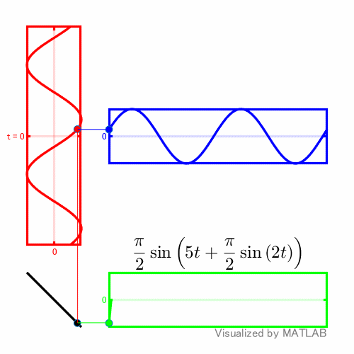

# Practice example on MATLAB Graphics Object: Visualize Phase Modulation

This repository provides two live scripts that walk you through the steps to develop the `plotPhaseModulation` function shown below.

```matlab
fC = 5;
fD = 2;
plotPhaseModulation(fC,fD,'output.gif');
```



Comments are currently provided in Japanese only. English version will be provided if there's a need.


