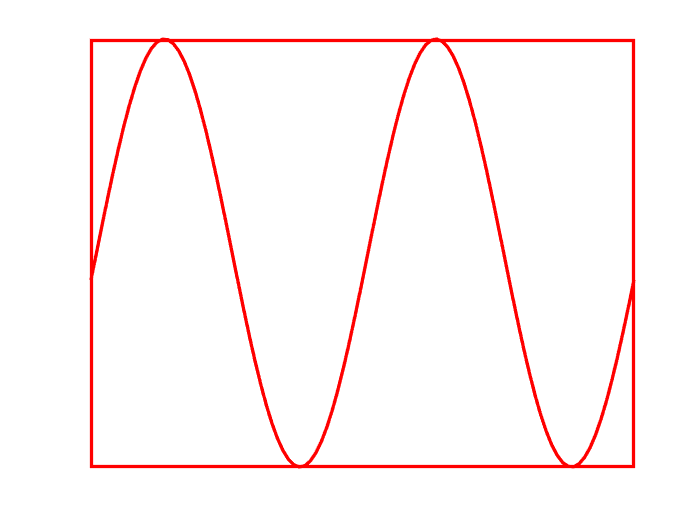
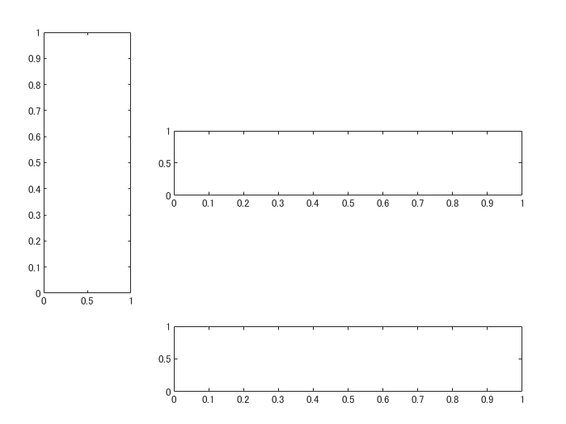

# このプロットどうやって描いたの？：PM変調の図


Copyright 2020 Michio Inoue


こちら（[Wikipedia:位相変調](https://ja.wikipedia.org/wiki/%E4%BD%8D%E7%9B%B8%E5%A4%89%E8%AA%BF)）で図示されているものを MATLAB で再現します！


4 つのAxes オブジェクトの配置や色付け、Annotation オブジェクトの配置など・・いろんな要素が絡んだいい練習課題でしたので、作成の過程を纏めました。


読んだあと、MATLAB のグラフィックスオブジェクトに対するハードルはぐっと下がるはず。


[グラフィックス オブジェクトの取り扱い](https://jp.mathworks.com/help/matlab/learn_matlab/understanding-handle-graphics-objects.html)


# まずはいろんな確認から
## 動くサインカーブ


とりあえず 2 波長分、0 から 4までサイン波を書いてみます。


```matlab
N = 100;
t0 = linspace(0,4*pi,N);
y = sin(t0);
handle_line = plot(t0,y);
```


この波形をぬめぬめ動かすには・・座標軸は固定した上で `t` を少しづつ大きくしてみます。


まずは座標軸の handle を確保して座標軸を固定。


```matlab
handle_axes = gca;
handle_axes.XLim = [0,4*pi];
```


そして for ループで `y` の値を変えていきます。


```matlab
dt = 4*pi/N;
for ii=1:N % 2波長分描きます。
    t = t0 + dt*(ii-1);
    y = sin(t);
    handle_line.YData = y;
    drawnow
end
```


できた。x 軸の値が固定という点がなんとなく気持ち悪いですが、これで行きます。


  
## Axes オブジェクトの枠


プロットの枠もいい感じにしていきます。 [Axes オブジェクトのプロパティ](https://jp.mathworks.com/help/matlab/ref/matlab.graphics.axis.axes-properties.html) に何があるのか確認しながら進めます。


まずは軸ラベル。これは簡単、`XTick` と `YTick` プロパティーを消しちゃえばOK。線も太くしたいので、`LineWidth` も触っておきます。


```matlab
handle_axes.XTick = [];
handle_axes.YTick = [];
handle_axes.LineWidth = 2;
```




いい感じ。


あと枠の色も変えたいときには・・`XColor`、`YColor` プロパティでした。とりあえず赤にしてみます。ちなみに `Color` プロパティは背景色。ついでにサイン派も赤く・太くしておきます。


```matlab
handle_axes.XColor = 'red';
handle_axes.YColor = 'red';
handle_line.Color = 'red';
handle_line.LineWidth = 2;
```


これで基本は完成。


# Axes オブジェクトの配置


さて、4 つの座標軸を配置します。


前回（[このプロットどうやって描いたの？：複数プロット、アニメーション編](https://qiita.com/eigs/items/c6efb11c145e4e0e8577)）は `subplot` 関数を使いましたが、ちょいと配置が複雑そう。こういうときは Axes オブジェクトの `Position` プロパティを直接設定してしまいましょう。そもそも `subplot` 関数はその作業をちょっと楽にしているだけですし。


こんな Figure 上の構成で行きます。


Axes の `Position` プロパティは、左下端の Figure 上での位置と、幅と高さを指定する 4 要素で成り立っていますのでこんな感じ。


```matlab
handle_fig = figure;
handle_axesA = axes(handle_fig,'Position',[1,1,2,2]/13);
handle_axesB = axes(handle_fig,'Position',[4,1,8,2]/13);
handle_axesC = axes(handle_fig,'Position',[1,4,2,8]/13);
handle_axesD = axes(handle_fig,'Position',[4,7,8,2]/13); 
```


あれ、枠が下と左にしかない。


これは `Box` プロパティ（'on' / 'off'）です。全部 'on' にしましょう。


```matlab
handle_axesA.Box = 'on';
handle_axesB.Box = 'on';
handle_axesC.Box = 'on';
handle_axesD.Box = 'on';
```




Figure 上に Axes が 1 つだと勝手に 'on' 、2 つ以上だと 'off' になる設定なんでしょうかね。


# 余談：枠を消す方法


ん？そういえば、枠を消すにはどうするんだと？


調べたところ、MATLAB Answers にこんな投稿がありました：[How do I remove the border lines surrounding an axes?](https://jp.mathworks.com/matlabcentral/answers/97101-how-do-i-remove-the-border-lines-surrounding-an-axes)


要は枠の色を背景色、もしくは 'none' と設定すればOKとのこと。


```matlab
handle_axesA.XColor = 'none';
handle_axesA.YColor = 'none';
```


消えました・・・。


# いったんまとめ


ここまでで確認できたことをまとめると・・


   -  動く波の描画 
   -  Axes オブジェクト：枠の色設定、軸ラベルの消し方 
   -  4 つの Axes オブジェクト設置、枠の消し方 


ということで、全部組み合わせます。


枠設定は繰り返しが多いので関数化します。


```matlab
function handle_axes = setUpAxes(handle_fig, Position, color)
    handle_axes = axes(handle_fig,'Position',Position,'Box',"on");
    handle_axes.XColor = color;
    handle_axes.YColor = color;
    handle_axes.XTick = [];
    handle_axes.YTick = [];
    handle_axes.LineWidth = 2;
end
```
```matlab
addpath('.\function')
handle_fig = figure('Position',[100,100,400,400]);
handle_axesA = setUpAxes(handle_fig,[1,1,2,2]/13,'none');
handle_axesB = setUpAxes(handle_fig,[4,1,8,2]/13,'green');
handle_axesC = setUpAxes(handle_fig,[1,4,2,8]/13,'red');
handle_axesD = setUpAxes(handle_fig,[4,7,8,2]/13,'blue');
```


Axes C（赤）と Axes D（青）にサイン波を追加します。


```matlab
N = 100;
t0 = linspace(0,4*pi,N);
y = pi/2*sin(t0); % 振幅は pi/2
handle_lineC = plot(handle_axesC,y,t0); % Axes C は縦向き
handle_lineD = plot(handle_axesD,t0,y);
handle_axesC.YLim = [0,4*pi]; % Axes C は縦向き
handle_axesD.XLim = [0,4*pi];
```


  
## おい、せっかくの設定を・・


そう `plot` 関数ってこういうところあるんですよね。事前設定をリセットしちゃう。親切心なんでしょうが。こんな時にはただ従順に線を書く `line` 関数にしましょう。


`line` 関数でやりなおし。色を Axes と同じに、そして線も太くしておきます。


枠が消えちゃっている Axes A にも線を追加します。


```matlab
handle_fig = figure('Position',[100,100,400,400]);
handle_axesA = setUpAxes(handle_fig,[1,1,2,2]/13,'none');
handle_axesB = setUpAxes(handle_fig,[4,1,8,2]/13,'green');
handle_axesC = setUpAxes(handle_fig,[1,4,2,8]/13,'red');
handle_axesD = setUpAxes(handle_fig,[4,7,8,2]/13,'blue');

handle_axesA.XLim = [-pi/2,pi/2];
handle_axesA.YLim = [-pi/2,pi/2];
handle_axesB.XLim = [0,4*pi];
handle_axesB.YLim = [-pi/2,pi/2];
handle_axesC.XLim = [-pi/2,pi/2]; % Axes C は縦向き
handle_axesC.YLim = [0,4*pi]; % Axes C は縦向き
handle_axesD.XLim = [0,4*pi];
handle_axesD.YLim = [-pi/2,pi/2];

N = 100;
t0 = linspace(0,4*pi,N);
y = sin(t0);
handle_lineC = line(handle_axesC,y,t0,'Color','red','LineWidth',2); % Axes C は縦向き
handle_lineD = line(handle_axesD,t0,y,'Color','blue','LineWidth',2);
handle_lineA = line(handle_axesA, [-1,1],[1,-1],'Color','black','LineWidth',2);

dt = 4*pi/N;
for ii=1:N % 2波長分描きます。
    t = t0 + dt*(ii-1);
    y = pi/2*sin(t);
    handle_lineC.XData = y; % Axes C は縦向き
    handle_lineD.YData = y;
    drawnow
end
```


