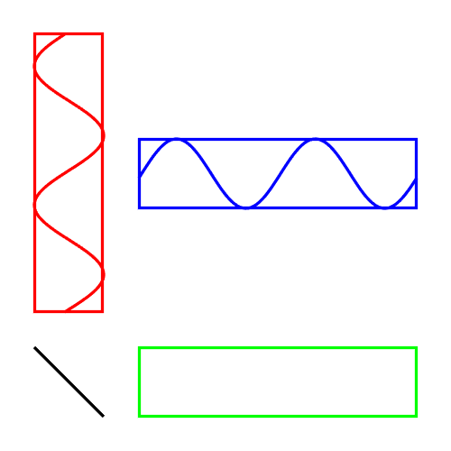
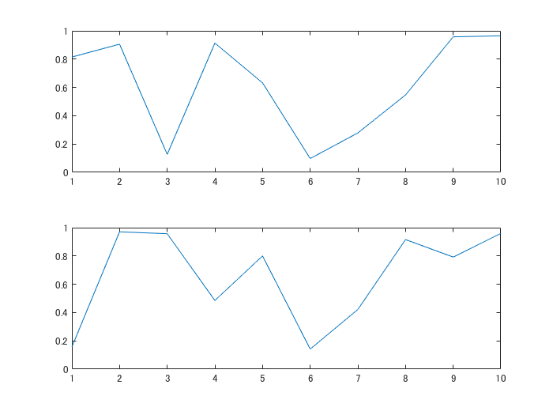
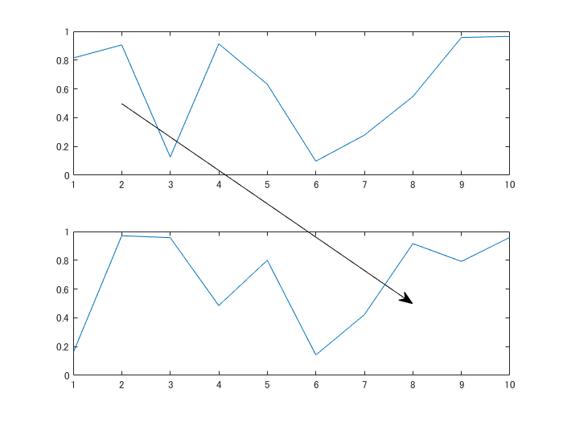
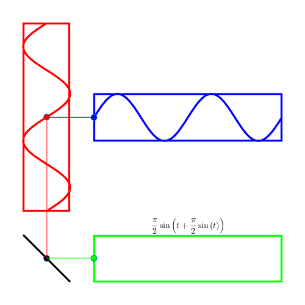

# このプロットどうやって描いたの？：PM変調の図


Copyright 2020 Michio Inoue





こちら（[Wikipedia:位相変調](https://ja.wikipedia.org/wiki/%E4%BD%8D%E7%9B%B8%E5%A4%89%E8%AA%BF)）で図示されているものを MATLAB で再現しよういう試み。前回はここまでできました。


あとは？


   -  各プロットで動いている点 
   -  それぞれを結ぶ線 


ですね。やっていきましょう。


# Axes 間をまたぐ線


これは `annotation` 関数で描きます。


ただこちらの記事（[MATLABのプロットでアノテーションをつける](https://qiita.com/Monzo_N/items/c68f52e88fd532671a19)）でも触れているように、annotation オブジェクトは Figure 内での位置を指定する必要があります。結ぶべき動く点は Axes 上で定義されるデータ値なので、この変換が手間ですが避けられません。


ここは関数を作って乗り越えましょう。


```matlab
function [xFig,yFig] = axesPosition2figurePosition(data,handle_axes)

    x = data(1);
    y = data(2);
    handle_axes.Units = 'normalize';
    axesPos = handle_axes.Position;
    %  axesPos(1): x position of axes in figure
    %  axesPos(2): y position of axes in figure
    %  axesPos(3): width of axes in figure scale
    %  axesPos(4): height of axes in figure scale
    widthData = handle_axes.XLim(2)-handle_axes.XLim(1);
    heightData = handle_axes.YLim(2)-handle_axes.YLim(1);
    xmin = handle_axes.XLim(1);
    ymin = handle_axes.YLim(1);

    xFig = (x-xmin)/widthData*axesPos(3) + axesPos(1);
    yFig = (y-ymin)/heightData*axesPos(4) + axesPos(2);

end
```


入力は Axes 上のデータ値と Axes オブジェクト。Axes オブジェクトの表示範囲（`XLim`, `YLim`）と Figure 上での位置（`Position`）の情報をもとに、データ値を Figure 上での相対位置 (x,y) に変換します。


例えば


```matlab
[xAfig,yAfig] = axesPosition2figurePosition([xA,yA],handle_axesA);
```


こんな感じ。


実際に使ってみます。


```matlab
addpath("function");
handle_axes1 = subplot(2,1,1);
plot(rand(10,1));
handle_axes2 = subplot(2,1,2);
plot(rand(10,1));
```




そして上のグラフの (x,y) = (2,0.5) から 下のグラフの (x,y) = (8,0.5) まで線を引いてみます。


```matlab
[xFig1,yFig1] = axesPosition2figurePosition([2,0.5],handle_axes1);
[xFig2,yFig2] = axesPosition2figurePosition([8,0.5],handle_axes2);
annotation("arrow",[xFig1,xFig2],[yFig1,yFig2])
```




こんな具合です。


# 各プロットで動いている点


それぞれのプロットで動いている点を描いて、上の方法でつないでみます。


ついでに Axes B でどんどん伸びてくる線も書いておきます。


```matlab
clear
close all
% Figure の上で Axes 作成
handle_fig = figure('Position',[100,100,400,400],'Color','w');
handle_axesA = setUpAxes(handle_fig,[1,1,2,2]/13,'none');
handle_axesB = setUpAxes(handle_fig,[4,1,8,2]/13,'green');
handle_axesC = setUpAxes(handle_fig,[1,4,2,8]/13,'red');
handle_axesD = setUpAxes(handle_fig,[4,7,8,2]/13,'blue');

% それぞれの Axes 表示範囲を固定
handle_axesA.XLim = [-pi/2,pi/2];
handle_axesA.YLim = [-pi/2,pi/2];
handle_axesB.XLim = [0,4*pi];
handle_axesB.YLim = [-pi/2,pi/2];
handle_axesC.XLim = [-pi/2,pi/2]; % Axes C は縦向き
handle_axesC.YLim = [0,4*pi]; % Axes C は縦向き
handle_axesD.XLim = [0,4*pi];
handle_axesD.YLim = [-pi/2,pi/2];

% Axes A の y = -x の線を描く
handle_lineA = line(handle_axesA, [-pi/2,pi/2],[pi/2,-pi/2],'Color','black','LineWidth',2);

% Axes C, Axes D のサインカーブ
N = 100;
t0 = linspace(0,4*pi,N);
y = pi/2*sin(t0);
handle_lineC = line(handle_axesC,y,t0,'Color','red','LineWidth',2); % Axes C は縦向き
handle_lineD = line(handle_axesD,t0,y,'Color','blue','LineWidth',2);

% 動く点座標を描画
tC = 2*pi+y(1); % y position in C axes
xC = pi/2*sin(tC); % x position in C axes
handle_pointA = line(handle_axesA,xC,-xC,'Marker','o','MarkerFaceColor','black');
handle_pointB = line(handle_axesB,0,-xC,'Marker','o','MarkerFaceColor','green');
handle_pointC = line(handle_axesC,xC,tC,'Marker','o','MarkerFaceColor','red');
handle_pointD = line(handle_axesD,0,y(1),'Marker','o','MarkerFaceColor','blue');

% Axes B に新たな線を追加（時間経過とともに伸びます）
handle_lineB = line(handle_axesB,0,-xC,'Color','green','LineWidth',2);

% 式表示
handle_axesB.Title.Interpreter = 'latex';
handle_axesB.Title.FontSize = 15;
handle_axesB.Title.String = "$$\frac{\pi}{2}\sin\left(" + ...
    "t + \frac{\pi}{2} \sin \left( t \right) \right)$$";

% 動く点を結ぶ線を描きます。
% Figure 座標系に変換
[xAfig,yAfig] = axesPosition2figurePosition([xC,-xC],handle_axesA);
[xBfig,yBfig] = axesPosition2figurePosition([0,-xC],handle_axesB);
[xCfig,yCfig] = axesPosition2figurePosition([xC,tC],handle_axesC);
[xDfig,yDfig] = axesPosition2figurePosition([0,y(1)],handle_axesD);
% まず A <-> B
handle_annAB = annotation('line',[xAfig,xBfig],[yAfig,yBfig],'Color','green');
handle_annAC = annotation('line',[xAfig,xCfig],[yAfig,yCfig],'Color','red');
handle_annCD = annotation('line',[xCfig,xDfig],[yCfig,yDfig],'Color','blue');

% あとはデータを更新して動かすだけ！
dt = 4*pi/N;
for ii=1:N % 2波長分描きます。
    t = t0 + dt*ii;
    y = pi/2*sin(t);
    
    % Axes C, Axes D のサインカーブ
    handle_lineC.XData = y; % Axes C は縦向き
    handle_lineD.YData = y;
    
    % 動く点座標を描画
    tC = 2*pi+y(1); % y position in C axes
    xC = pi/2*sin(tC+dt*ii); % x position in C axes
    handle_pointA.XData = xC;
    handle_pointA.YData = -xC;
    handle_pointB.YData = -xC;
    handle_pointC.XData = xC;
    handle_pointC.YData = tC;
    handle_pointD.YData = y(1);
    
    % Axes B にデータ追加（線を伸ばす）
    handle_lineB.XData = [dt*ii,handle_lineB.XData];
    handle_lineB.YData = [handle_lineB.YData,-xC];
    
    % 動く点を結ぶ線を描きます。
    % Figure 座標系に変換
    [xAfig,yAfig] = axesPosition2figurePosition([xC,-xC],handle_axesA);
    [xBfig,yBfig] = axesPosition2figurePosition([0,-xC],handle_axesB);
    [xCfig,yCfig] = axesPosition2figurePosition([xC,tC],handle_axesC);
    [xDfig,yDfig] = axesPosition2figurePosition([0,y(1)],handle_axesD);
    % まず A <-> B
    handle_annAB.X = [xAfig,xBfig];
    handle_annAB.Y = [yAfig,yBfig];
    handle_annAC.X = [xAfig,xCfig];
    handle_annAC.Y = [yAfig,yCfig];
    handle_annCD.X = [xCfig,xDfig];
    handle_annCD.Y = [yCfig,yDfig];
    drawnow
end
```




できあがり。


# 仕上げ


ここまでは 搬送波（Axes C）と 伝送信号（Axes D）の周波数が同じですが、いろいろ遊べるようにここを可変にして関数化しちゃいましょう。GIF ファイルを生成するコマンドも入れておきます。


あと少し見栄え面では y = 0 のところに線が欲しい気がします。


```matlab
handle_axesB.YTick = 0;
handle_axesC.XTick = 0; % Axes C は縦向き
handle_axesC.YTick = 2*pi; % 真ん中（y = 2pi を t = 0 と表示）
handle_axesC.YTickLabel = "t = 0"; % 真ん中（y = 2pi を t = 0 と表示）
handle_axesD.YTick = 0;
grid(handle_axesB,'on');
grid(handle_axesC,'on');
grid(handle_axesD,'on');
```


こんな感じで追加します。以下を実行すればできあがり！


```matlab
fC = 5;
fD = 2;
addpath('..\function\');
plotPhaseModulation(fC,fD);
```


以下のように第三引数にファイル名を入れると GIF 動画作ります。


```matlab
% plotPhaseModulation(fC,fD,'output.gif');
```


注：R2019b Update 2 では Live Script 上で実行するとエラーがでます。原因は分かりませんが、`getFrame` で Figure 画面をキャプチャすると、グラフィックスオブジェクトの一部に影響が出ている様子。ごちゃごちゃしすぎたか。ですので、コマンドラインで実行してください・・。


